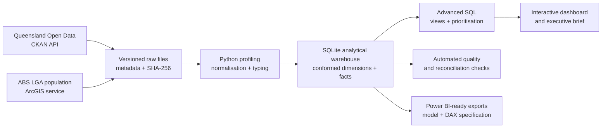

# Queensland Road Safety Investment Prioritisation

[](https://github.com/didi-au/queensland-road-safety-analytics/actions/workflows/quality.yml)
[](https://didi-au.github.io/queensland-road-safety-analytics/)

**Python · SQL · SQLite · data modelling · data quality · decision analysis · dashboarding**

I built an end-to-end analytics product using official Queensland road-crash and ABS population data to answer one practical question:

> Where should limited road-safety investigation and intervention resources be prioritised?

[Open the interactive dashboard](https://didi-au.github.io/queensland-road-safety-analytics/) · [Read the executive brief](reports/EXECUTIVE_BRIEF.md) · [Review the SQL](sql/02_analysis_queries.sql) · [See the data model](docs/DATA_MODEL.md)

## Recommendation

Use two transparent prioritisation tracks instead of one opaque “risk score”:

1. **Absolute-burden track:** prioritise scalable programs in LGAs carrying the largest total fatal-and-serious-injury (FSI) burden.
2. **Diagnostic track:** investigate regional LGAs with high resident-normalised burden, subject to minimum-count and exposure-data checks.

This distinction matters. Brisbane recorded the greatest five-year volume of serious harm, while population normalisation surfaced a different regional shortlist. Population is not traffic exposure, so the rate is a screening signal—not a probability that a resident will crash.

## Findings at a glance

| Finding | Evidence | Decision implication |
|---|---:|---|
| Queensland FSI casualties increased | 7,293 in 2020 to 8,943 in 2024 (**+22.6%**) | The recorded burden did not improve across the selected endpoints |
| Brisbane carried the largest five-year FSI burden | **7,609** casualties, 2020–2024 | High-volume areas suit scalable program planning |
| Gold Coast, Logan, Moreton Bay and Sunshine Coast also remained high burden | Each ranked in the highest burden quintile in **5/5 years** | Persistence is more useful than a one-year spike |
| Resident normalisation changed the shortlist | Cook, Somerset, Isaac, Charters Towers and North Burnett surfaced among eligible LGAs | Commission deeper exposure and corridor diagnostics before treatment selection |
| Factor profiles varied by police region | Far Northern recorded the highest drink-driving share (**11.81%**) | Tailor the next diagnostic question; do not claim causation |

Analysis uses the five latest complete years, 2020–2024. The source contains 2025 records, but I deliberately exclude that incomplete year from like-for-like comparisons.

## What I built

- Discovered and downloaded six Queensland Government resources through the CKAN API.
- Captured retrieval metadata and SHA-256 checksums for reproducibility.
- Normalised and modelled **415,407 crash records** in a portable SQLite warehouse.
- Integrated ABS estimated resident population for all **78 matched Queensland LGAs**.
- Designed multiple fact tables at their published grains to prevent many-to-many double counting.
- Wrote analytical SQL using CTEs, window functions, ranking, segmentation and reconciliation.
- Automated schema, key, relationship, range, completeness and business-rule tests.
- Produced a decision-focused web dashboard and a Power BI-ready star-schema/DAX implementation specification.
- Wrote an executive brief that separates evidence, recommendation, assumptions and limitations.

## Architecture



SQLite is deliberate: a reviewer can reproduce the full analytical build locally without cloud credentials. The dimensional grains and SQL logic can be migrated to a production database without changing the analytical definitions.

## Repository guide

```text
├── config/                 governed source manifest
├── dashboard/              deployable interactive dashboard
├── docs/                   architecture, model, KPIs and source profile
├── reports/                executive brief and BI implementation pack
├── sql/                    analytical views and decision queries
├── src/                    ingestion, transformation, validation and outputs
├── tests/                  automated unit tests
└── .github/workflows/      CI quality checks and Pages deployment
```

Raw files, the local database and large exports are deliberately excluded from Git. The pipeline retrieves them from the official sources.

## Reproduce the analysis

Prerequisites: Python 3.11+ and `make`.

```bash
git clone https://github.com/didi-au/queensland-road-safety-analytics.git
cd queensland-road-safety-analytics
python3 -m venv .venv
source .venv/bin/activate
pip install -r requirements.txt
make all
```

The full run downloads a large official crash-location file and builds the local warehouse. To view the tracked dashboard without rebuilding the pipeline:

```bash
python3 -m http.server 8000
# open http://localhost:8000/dashboard/
```

## Analytical safeguards

- **No causal overclaiming:** recorded factor involvement is not proof of crash causation.
- **Compatible grains only:** the five supplementary TMR files are published aggregates and are not joined to individual crashes.
- **No false precision:** resident population is not vehicle-kilometres travelled, freight movement, tourism or through-traffic.
- **Complete periods:** preliminary 2025 records are retained but excluded from comparable annual rankings.
- **Transparent judgement:** counts, rates, persistence and severity remain visible rather than being hidden in a composite score.

See the full [KPI catalogue](docs/KPI_CATALOGUE.md), [data-quality report](reports/generated/data_quality.md) and [method limitations](reports/EXECUTIVE_BRIEF.md#limitations-that-affect-the-decision).

## Data sources and attribution

- Queensland Department of Transport and Main Roads, [Crash data from Queensland roads](https://www.data.qld.gov.au/dataset/crash-data-from-queensland-roads), Creative Commons Attribution 4.0.
- Australian Bureau of Statistics, LGA estimated resident population used as a contextual denominator.

The current project source release was retrieved in April 2026. This independent portfolio analysis is not an official Queensland Government product.

## Portfolio walkthrough

A concise interview/demo narrative is available in [reports/WALKTHROUGH_SCRIPT.md](reports/WALKTHROUGH_SCRIPT.md). A Power BI implementation pack is documented in [reports/POWER_BI_SPEC.md](reports/POWER_BI_SPEC.md); this repository does **not** claim that a `.pbix` file is included.
